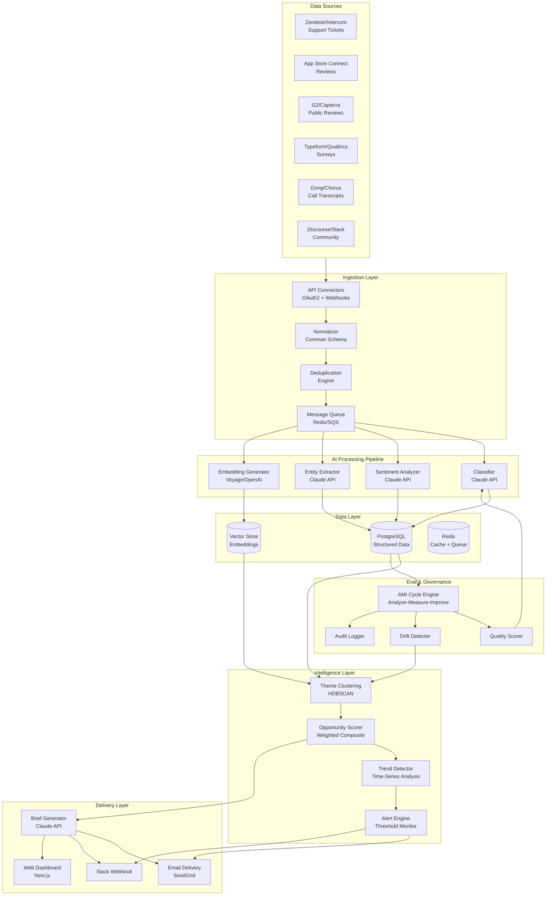
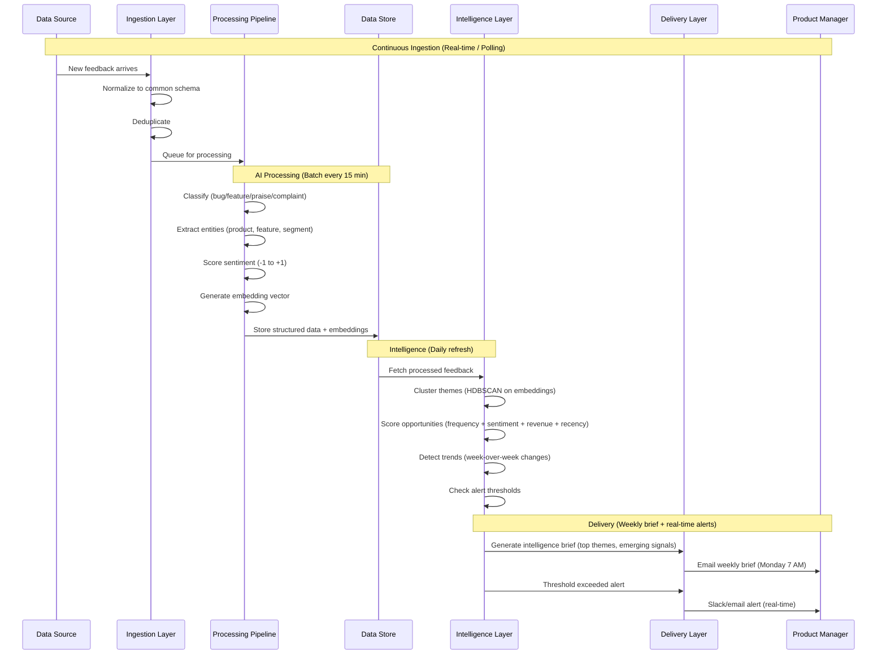

# Technical Architecture: AI Customer Intelligence Engine

**Author:** Angel Torres | **Date:** 2026-02-24

---

## System Architecture Diagram (Mermaid)



---

## Data Flow Sequence



---

## Component Detail

### Ingestion Layer
| Component | Technology | Purpose | Scaling Strategy |
|-----------|-----------|---------|-----------------|
| API Connectors | Custom adapters per source | Fetch feedback from 6 channels | One adapter per source; add new sources without pipeline changes |
| Normalizer | Python/Node.js | Map diverse formats to common schema | Schema versioning; backward-compatible migrations |
| Deduplication | Fuzzy matching + hash | Prevent counting same feedback twice | Exact hash for duplicates; cosine similarity for near-duplicates |
| Queue | Redis Streams or SQS | Buffer between ingestion and processing | Horizontal scaling; dead letter queue for failures |

### Common Feedback Schema
```json
{
  "id": "uuid",
  "source": "zendesk|appstore|g2|survey|gong|community",
  "source_id": "original-id-from-source",
  "text": "raw feedback text",
  "customer_id": "anonymous-customer-hash",
  "customer_segment": "enterprise|mid-market|smb",
  "product": "sailthru|cheetah|selligent",
  "timestamp": "2026-02-24T10:00:00Z",
  "metadata": {
    "rating": 4,
    "ticket_priority": "high",
    "arr_band": "$100K-$500K"
  },
  "processing": {
    "classification": "feature_request",
    "sentiment_score": 0.3,
    "sentiment_confidence": 0.92,
    "entities": ["email_builder", "segmentation", "api"],
    "embedding_id": "vec-uuid"
  }
}
```

### AI Processing Pipeline
| Step | Model | Input | Output | Latency | Cost/1K items |
|------|-------|-------|--------|---------|---------------|
| Classification | Claude 3.5 Haiku | Feedback text | Category + confidence | ~200ms | ~$0.15 |
| Sentiment | Claude 3.5 Haiku | Feedback text | Score (-1 to +1) + confidence | ~200ms | ~$0.10 |
| Entity Extraction | Claude 3.5 Haiku | Feedback text + product taxonomy | Product areas, features, segments | ~300ms | ~$0.20 |
| Embedding | Voyage-3 or text-embedding-3-small | Feedback text | 1024-dim vector | ~100ms | ~$0.02 |
| Brief Generation | Claude 3.5 Sonnet | Theme clusters + scores | Weekly intelligence brief | ~3s | ~$0.50/brief |

**Cost estimate at scale:** 5,000 feedback items/month = ~$25/month in API costs

### Intelligence Layer
| Component | Algorithm | Configuration |
|-----------|----------|---------------|
| Clustering | HDBSCAN | min_cluster_size=5, min_samples=3, metric=cosine |
| Scoring | Weighted composite | Frequency (30%) + Sentiment intensity (25%) + Revenue impact (25%) + Recency (20%) |
| Trend detection | Week-over-week delta | Alert if theme volume increases >50% or sentiment drops >0.3 |
| Alerting | Threshold monitor | Configurable per-theme; default: >20 mentions in 48 hours |

---

## Infrastructure

### Deployment
- **Container orchestration:** Docker Compose (MVP) → Kubernetes (scale)
- **Hosting:** Vercel (dashboard) + Railway/Render (backend) or self-hosted VPS
- **CI/CD:** GitHub Actions
- **Monitoring:** Sentry (errors) + custom metrics dashboard

### Security & Compliance
- All feedback anonymized before LLM processing (no PII in API calls)
- API keys stored in environment variables (never in code)
- Data encrypted at rest (PostgreSQL) and in transit (TLS)
- SOC 2 Type II alignment for enterprise deployment
- GDPR: right to deletion propagated through pipeline

---

_Architecture designed for Level 2 AI capabilities with modular components that support Level 3 autonomous agent integration (per Gupta's AI Product Strategy framework)._
